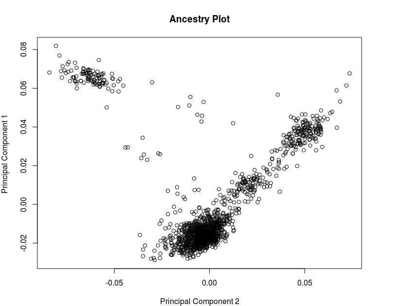

# Data pre-processing

For this tutorial we use genotype data files formatted for use with [PLINK](http://pngu.mgh.harvard.edu/~purcell/plink/") software. We utilize the function, `read.plink` from snpStats, which allows the reading in of data formatted as .bed, .bim, and .fam files. The .bed file contains the genotype information, coded in binary. The .bim file contains information for each SNP with a respective column for each of the following information: chromosome number, SNP name (typically an rs #), genetic distance (not necessary for this tutorial), chromosomal position, identity of allele 1, and identity of allele 2. The assignment of allele 1 and allele 2, is related to the effect allele, or the allele that is being counted when we assign a numeric value to a genotype. This is typically assigned based on allele frequency, though not always. In this tutorial, allele 1 pertains to the minor, or less common allele. Lastly, the .fam file contains information for each samples with a respective column for each of the following information: family ID (this will be used to identify each sample when read into R), individual ID, paternal ID, maternal ID, sex (coded as 1 = male, 2 = female), and phenotype. In this tutorial we utilize a supplemental clinical file for outcome variables and additional covariates.

Alternatively, similar genotype information can also be formatted for PLINK software as .ped and .map files. The information of the .ped file can be thought of as a combination of the .bed and .fam files. It is a large table with the first six columns identical to a .fam file, followed by a columns containing the genotype data for each SNP. The .map file contains the first four columns of the .bim file, without the allele assignments. These files can be read in using the function, `read.pedfile`, from snpStats. More information about the formatting of these files can be found on the PLINK website.

## ---- step1 ---
```r
library(snpStats)

# Read in PLINK files
geno <- read.plink(gwas.fn$bed, gwas.fn$bim, gwas.fn$fam, na.strings = ("-9"))

# Obtain the SnpMatrix object (genotypes) table from geno list
# Note: Phenotypes and covariates will be read from the clinical data file, below
genotype <- geno$genotype
print(genotype)                  # 861473 SNPs read in for 1401 subjects
```
```
## A SnpMatrix with  1401 rows and  861473 columns
## Row names:  10002 ... 11596 
## Col names:  rs10458597 ... rs5970564
```

```r
#Obtain the SNP information from geno list
genoBim <- geno$map
colnames(genoBim) <- c("chr", "SNP", "gen.dist", "position", "A1", "A2")
print(head(genoBim))
```

```
##            chr        SNP gen.dist position   A1 A2
## rs10458597   1 rs10458597        0   564621 <NA>  C
## rs12565286   1 rs12565286        0   721290    G  C
## rs12082473   1 rs12082473        0   740857    T  C
## rs3094315    1  rs3094315        0   752566    C  T
## rs2286139    1  rs2286139        0   761732    C  T
## rs11240776   1 rs11240776        0   765269    G  A
```
```r
# Remove raw file to free up memory
rm(geno)
```
Supplemental clinical data is found in a corresponding CSV file for each sample. It contains a column for the sample ID (Family ID in the .fam file) and a respective column for each of the following variables: coronary artery disease status (coded as 0 = control and 1 = affected), sex (coded as 1 = male, 2 = female), age (years), triglyceride level (mg/dL), high-density lipoprotein level (mg/dL), low-density lipoprotein level (mg/dL).

```r
# Read in clinical file
clinical <- read.csv(clinical.fn,
                     colClasses=c("character", "factor", "factor", rep("numeric", 4)))
rownames(clinical) <- clinical$FamID
print(head(clinical))
```
```
##       FamID CAD sex age  tg hdl ldl
## 10002 10002   1   1  60  NA  NA  NA
## 10004 10004   1   2  50  55  23  75
## 10005 10005   1   1  55 105  37  69
## 10007 10007   1   1  52 314  54 108
## 10008 10008   1   1  58 161  40  94
## 10009 10009   1   1  59 171  46  92
```
We filter the genotype data to only include samples with corresponding clinical data by indexing the genotype object using only row names that match the sample IDs.

```r
# Subset genotype for subject data
genotype <- genotype[clinical$FamID, ]
print(genotype)  # Tutorial: All 1401 subjects contain both clinical and genotype data
```
```
## A SnpMatrix with  1401 rows and  861473 columns
## Row names:  10002 ... 11596 
## Col names:  rs10458597 ... rs5970564
```

## SNP level filtering - Step 2
Once the data is loaded, we are ready to remove SNPs that fail to meet minimum criteria due to missing data, low variability or genotyping errors. snpStats provides functions, col.summary and row.summary, that return statistics on SNPs and samples, respectively.

```r
# Create SNP summary statistics (MAF, call rate, etc.)
snpsum.col <- col.summary(genotype)
print(head(snpsum.col))
```
```
##            Calls Call.rate Certain.calls       RAF         MAF       P.AA
## rs10458597  1398 0.9978587             1 1.0000000 0.000000000 0.00000000
## rs12565286  1384 0.9878658             1 0.9483382 0.051661850 0.00433526
## rs12082473  1369 0.9771592             1 0.9985391 0.001460920 0.00000000
## rs3094315   1386 0.9892934             1 0.8217893 0.178210678 0.04761905
## rs2286139   1364 0.9735903             1 0.8621701 0.137829912 0.02199413
## rs11240776  1269 0.9057816             1 0.9988180 0.001182033 0.00000000
##                   P.AB      P.BB       z.HWE
## rs10458597 0.000000000 1.0000000          NA
## rs12565286 0.094653179 0.9010116 -1.26529432
## rs12082473 0.002921841 0.9970782  0.05413314
## rs3094315  0.261183261 0.6911977 -4.03172248
## rs2286139  0.231671554 0.7463343 -0.93146122
## rs11240776 0.002364066 0.9976359  0.04215743
```
Using these summary statistics, we keep the subset of SNPs that meet our criteria for minimum call rate and minor allele frequency.

```r
# Setting thresholds
call <- 0.95
minor <- 0.01

# Filter on MAF and call rate
use <- with(snpsum.col, (!is.na(MAF) & MAF > minor) & Call.rate >= call)
use[is.na(use)] <- FALSE                # Remove NA's as well

cat(ncol(genotype)-sum(use),
"SNPs will be removed due to low MAF or call rate.\n") #203287 SNPs will be removed
```
```
## 203287 SNPs will be removed due to low MAF or call rate.
```
```r
# Subset genotype and SNP summary data for SNPs that pass call rate and MAF criteria
genotype <- genotype[,use]
snpsum.col <- snpsum.col[use,]

print(genotype)                           # 658186 SNPs remain
```
```
## A SnpMatrix with  1401 rows and  658186 columns
## Row names:  10002 ... 11596 
## Col names:  rs12565286 ... rs5970564
```
## Sample level filtering - Step 3
The second stage of data pre-processing involves filtering samples, i.e. removing individuals due to missing data, sample contamination, correlation (for population-based investigations), and racial/ethnic or gender ambiguity or discordance. In our study, we address these issues by filtering on call rate, heterozygosity, cryptic relatedness and duplicates using identity-by-descent, and we visually assess ancestry.

### Basic sample filtering
Sample level quality control for missing data and heterozygosity is achieved using the row.summary function from snpStats. An additional heterozygosity F statistic calculation is carried out with the form, |F|=(1−O/E), where O is observed proportion of heterozygous genotypes for a given sample and E is the expected proportion of heterozygous genotypes for a given sample based on the minor allele frequency across all non-missing SNPs for a given sample.

```r
library(SNPRelate)                      # LD pruning, relatedness, PCA
library(plyr)

# Create sample statistics (Call rate, Heterozygosity)
snpsum.row <- row.summary(genotype)

# Add the F stat (inbreeding coefficient) to snpsum.row
MAF <- snpsum.col$MAF
callmatrix <- !is.na(genotype)
hetExp <- callmatrix %*% (2*MAF*(1-MAF))
hetObs <- with(snpsum.row, Heterozygosity*(ncol(genotype))*Call.rate)
snpsum.row$hetF <- 1-(hetObs/hetExp)

head(snpsum.row)
```
```
##       Call.rate Certain.calls Heterozygosity          hetF
## 10002 0.9826554             1      0.3289825 -0.0247708291
## 10004 0.9891581             1      0.3242931 -0.0103236529
## 10005 0.9918427             1      0.3231825 -0.0062550972
## 10007 0.9861027             1      0.3241469 -0.0098475016
## 10008 0.9823333             1      0.3228218 -0.0075941985
## 10009 0.9913034             1      0.3213658 -0.0002633189
```

We apply filtering on call rate and heterozygosity, selecting only those samples that meet our criteria.

```r
# Setting thresholds
sampcall <- 0.95    # Sample call rate cut-off
hetcutoff <- 0.1    # Inbreeding coefficient cut-off

sampleuse <- with(snpsum.row, !is.na(Call.rate) & Call.rate > sampcall & abs(hetF) <= hetcutoff)
sampleuse[is.na(sampleuse)] <- FALSE    # remove NA's as well
cat(nrow(genotype)-sum(sampleuse), 
"subjects will be removed due to low sample call rate or inbreeding coefficient.\n") #0 subjects removed
```
```
## 0 subjects will be removed due to low sample call rate or inbreeding coefficient.
```
```r
# Subset genotype and clinical data for subjects who pass call rate and heterozygosity crtieria
genotype <- genotype[sampleuse,]
clinical<- clinical[ rownames(genotype), ]
```
## IBD analysis
In addition to these summary statistics, we also want to filter on relatedness criteria. We use the SNPRelate package to perform identity-by-descent (IBD) analysis. This package requires that the data be transformed into a GDS format file. IBD analysis is performed on only a subset of SNPs that are in linkage equilibrium by iteratively removing adjacent SNPs that exceed an LD threshold in a sliding window using the `snpgdsLDpruning` function.

```r
# Checking for Relatedness

ld.thresh <- 0.2    # LD cut-off
kin.thresh <- 0.1   # Kinship cut-off

# Create gds file, required for SNPRelate functions
snpgdsBED2GDS(gwas.fn$bed, gwas.fn$fam, gwas.fn$bim, gwas.fn$gds)
```
```
## Start snpgdsBED2GDS ...
##  BED file: "/Users/ericreed/Desktop/FoulkesLab/SIMFiles/GWAStutorial.bed" in the SNP-major mode (Sample X SNP)
##  FAM file: "/Users/ericreed/Desktop/FoulkesLab/SIMFiles/GWAStutorial.fam", DONE.
##  BIM file: "/Users/ericreed/Desktop/FoulkesLab/SIMFiles/GWAStutorial.bim", DONE.
## Wed Jun 24 16:51:03 2015     store sample id, snp id, position, and chromosome.
##  start writing: 1401 samples, 861473 SNPs ...
##      Wed Jun 24 16:51:03 2015    0%
##      Wed Jun 24 16:51:15 2015    100%
## Wed Jun 24 16:51:15 2015     Done.
## Optimize the access efficiency ...
## Clean up the fragments of GDS file:
##  open the file "/Users/ericreed/Desktop/FoulkesLab/SIMFiles/GWAStutorial.gds" (size: 308167905).
##  # of fragments in total: 39.
##  save it to "/Users/ericreed/Desktop/FoulkesLab/SIMFiles/GWAStutorial.gds.tmp".
##  rename "/Users/ericreed/Desktop/FoulkesLab/SIMFiles/GWAStutorial.gds.tmp" (size: 308167653).
##  # of fragments in total: 18.
```
```r
genofile <- openfn.gds(gwas.fn$gds, readonly = FALSE)

# Automatically added "-1" sample suffixes are removed
gds.ids <- read.gdsn(index.gdsn(genofile, "sample.id"))
gds.ids <- sub("-1", "", gds.ids)
add.gdsn(genofile, "sample.id", gds.ids, replace = TRUE)

#Prune SNPs for IBD analysis
set.seed(1000)
geno.sample.ids <- rownames(genotype)
snpSUB <- snpgdsLDpruning(genofile, ld.threshold = ld.thresh,
                          sample.id = geno.sample.ids, # Only analyze the filtered samples
                          snp.id = colnames(genotype)) # Only analyze the filtered SNPs

```
```
## Hint: it is suggested to call `snpgdsOpen' to open a SNP GDS file instead of `openfn.gds'.
```
```
## SNP pruning based on LD:
## Excluding 203287 SNPs on non-autosomes
## Excluding 0 SNP (monomorphic: TRUE, < MAF: NaN, or > missing rate: NaN)
## Working space: 1401 samples, 658186 SNPs
##  Using 1 (CPU) core
##  Sliding window: 500000 basepairs, Inf SNPs
##  |LD| threshold: 0.2
## Chromosome 1: 8.25%, 5863/71038
## Chromosome 3: 8.10%, 4906/60565
## Chromosome 6: 8.06%, 4364/54176
## Chromosome 12: 8.59%, 3619/42124
## Chromosome 21: 9.40%, 1171/12463
## Chromosome 2: 7.67%, 5655/73717
## Chromosome 4: 8.23%, 4582/55675
## Chromosome 7: 8.51%, 3947/46391
## Chromosome 11: 7.90%, 3495/44213
## Chromosome 10: 8.01%, 3837/47930
## Chromosome 8: 7.68%, 3709/48299
## Chromosome 5: 8.08%, 4537/56178
## Chromosome 14: 8.79%, 2467/28054
## Chromosome 9: 8.25%, 3392/41110
## Chromosome 17: 11.17%, 2227/19939
## Chromosome 13: 8.36%, 2863/34262
## Chromosome 20: 9.40%, 2139/22753
## Chromosome 15: 9.25%, 2396/25900
## Chromosome 16: 9.30%, 2566/27591
## Chromosome 18: 8.90%, 2335/26231
## Chromosome 19: 13.01%, 1494/11482
## Chromosome 22: 10.96%, 1248/11382
## 72812 SNPs are selected in total.
```
```r
snpset.ibd <- unlist(snpSUB, use.names=FALSE)
cat(length(snpset.ibd),"will be used in IBD analysis\n")  # Tutorial: expect 72812 SNPs
```
```
## 72812 will be used in IBD analysis
```
The `snpgdsIBDMoM` function computes the IBD coefficients using method of moments. The result is a table indicating kinship among pairs of samples.

```r
# Find IBD coefficients using Method of Moments procedure.  Include pairwise kinship.
ibd <- snpgdsIBDMoM(genofile, kinship=TRUE,
                    sample.id = geno.sample.ids,
                    snp.id = snpset.ibd,
                    num.thread = 1)

```
```
## Hint: it is suggested to call `snpgdsOpen' to open a SNP GDS file instead of `openfn.gds'.
```
```
## IBD analysis (PLINK method of moment) on SNP genotypes:
## Excluding 788661 SNPs on non-autosomes
## Excluding 0 SNP (monomorphic: TRUE, < MAF: NaN, or > missing rate: NaN)
## Working space: 1401 samples, 72812 SNPs
##  Using 1 (CPU) core
## PLINK IBD:   the sum of all working genotypes (0, 1 and 2) = 32757268
## PLINK IBD:   Wed Jun 24 16:51:53 2015    0%
## PLINK IBD:   Wed Jun 24 16:52:21 2015    100%
```
```r
ibdcoeff <- snpgdsIBDSelection(ibd)     # Pairwise sample comparison
head(ibdcoeff)
```
```
##     ID1   ID2        k0         k1    kinship
## 1 10002 10004 0.9201072 0.07989281 0.01997320
## 2 10002 10005 0.9478000 0.05220002 0.01305001
## 3 10002 10007 0.9209875 0.07901253 0.01975313
## 4 10002 10008 0.9312527 0.06874726 0.01718682
## 5 10002 10009 0.9386937 0.06130626 0.01532656
## 6 10002 10010 0.9146065 0.08539354 0.02134839
```

Using the IBD pairwise sample relatedness measure, we iteratively remove samples that are too similar using a greedy strategy in which the sample with the largest number of related samples is removed. The process is repeated until there are no more pairs of samples with kinship coefficients above our cut-off.

```r
# Check if there are any candidates for relatedness
ibdcoeff <- ibdcoeff[ ibdcoeff$kinship >= kin.thresh, ]

# iteratively remove samples with high kinship starting with the sample with the most pairings
related.samples <- NULL
while ( nrow(ibdcoeff) > 0 ) {

    # count the number of occurrences of each and take the top one
    sample.counts <- arrange(count(c(ibdcoeff$ID1, ibdcoeff$ID2)), -freq)
    rm.sample <- sample.counts[1, 'x']
    cat("Removing sample", as.character(rm.sample), 'too closely related to', 
    sample.counts[1, 'freq'],'other samples.\n')

    # remove from ibdcoeff and add to list
    ibdcoeff <- ibdcoeff[ibdcoeff$ID1 != rm.sample & ibdcoeff$ID2 != rm.sample,]
    related.samples <- c(as.character(rm.sample), related.samples)
}

# filter genotype and clinical to include only unrelated samples
genotype <- genotype[ !(rownames(genotype) %in% related.samples), ]
clinical <- clinical[ !(clinical$FamID %in% related.samples), ]

geno.sample.ids <- rownames(genotype)

cat(length(related.samples), 
"similar samples removed due to correlation coefficient >=", kin.thresh,"\n") 
```
```
## 0 similar samples removed due to correlation coefficient >= 0.1
```
```r
print(genotype)                         # Tutorial: expect all 1401 subjects remain
```
```
## A SnpMatrix with  1401 rows and  658186 columns
## Row names:  10002 ... 11596 
## Col names:  rs12565286 ... rs5970564
```

## Ancestry
To better understand ancestry, we plot the first two principal components of the genotype data. Principal component calculation is achieved via the `snpgdsPCA` function from SNPRelate. It is important to note that in this example we are reasonably confident that our samples are homogeneous, coming from european ancestry. Therefore, given that there are no clear outliers, we fail to remove any samples.

```r
# Checking for ancestry

# Find PCA matrix
pca <- snpgdsPCA(genofile, sample.id = geno.sample.ids,  snp.id = snpset.ibd, num.thread=1)
```
```
## Hint: it is suggested to call `snpgdsOpen' to open a SNP GDS file instead of `openfn.gds'.
```

```
## Principal Component Analysis (PCA) on SNP genotypes:
## Excluding 788661 SNPs on non-autosomes
## Excluding 0 SNP (monomorphic: TRUE, < MAF: NaN, or > missing rate: NaN)
## Working space: 1401 samples, 72812 SNPs
##  Using 1 (CPU) core
## PCA: the sum of all working genotypes (0, 1 and 2) = 32757268
## PCA: Wed Jun 24 16:54:27 2015    0%
## PCA: Wed Jun 24 16:54:57 2015    100%
## PCA: Wed Jun 24 16:54:57 2015    Begin (eigenvalues and eigenvectors)
## PCA: Wed Jun 24 16:54:58 2015    End (eigenvalues and eigenvectors)
```
```r
# Create data frame of first two principal comonents
pctab <- data.frame(sample.id = pca$sample.id,
                    PC1 = pca$eigenvect[,1],    # the first eigenvector
                    PC2 = pca$eigenvect[,2],    # the second eigenvector
                    stringsAsFactors = FALSE)

# Plot the first two principal comonents
plot(pctab$PC2, pctab$PC1, xlab="Principal Component 2", ylab="Principal Component 1", 
main = "Ancestry Plot")
```


```r
# Close GDS file
closefn.gds(genofile)

# Overwrite old genotype with new filtered version
save(genotype, genoBim, clinical, file=working.data.fname(3))
```

## SNP Filtering - HWE filtering on control samples
Finally, once samples are filtered, we return to SNP level filtering and apply a check of Hardy-Weinberg equilibrium. Rejection of Hardy-Weinberg equilibrium can be an indication of population substructure or genotyping errors. Given that we are performing a statistical test at every SNP, it is common to use a relatively lenient cut-off. In this example we only remove SNPs with p-values, corresponding to the HWE test statistic on CAD controls, of less than 1×10−6. We only test HWE on CAD controls due to possible violation of HWE caused by disease association.

```r
# Hardy-Weinberg SNP filtering on CAD controls

hardy <- 10^-6      # HWE cut-off

CADcontrols <- clinical[ clinical$CAD==0, 'FamID' ]
snpsum.colCont <- col.summary( genotype[CADcontrols,] )
HWEuse <- with(snpsum.colCont, !is.na(z.HWE) & ( abs(z.HWE) < abs( qnorm(hardy/2) ) ) )
rm(snpsum.colCont)

HWEuse[is.na(HWEuse)] <- FALSE          # Remove NA's as well
cat(ncol(genotype)-sum(HWEuse),"SNPs will be removed due to high HWE.\n")  # 1296 SNPs removed
```
```
## 1296 SNPs will be removed due to high HWE.
```
```r
# Subset genotype and SNP summary data for SNPs that pass HWE criteria
genotype <- genotype[,HWEuse]

print(genotype)                           # 656890 SNPs remain
```
```
## A SnpMatrix with  1401 rows and  656890 columns
## Row names:  10002 ... 11596 
## Col names:  rs12565286 ... rs28729663
```
```r
# Save genotype and SNVs filtered data to use in later analyses
save.image("Genotype.SNVsfiltered.Rdata")
