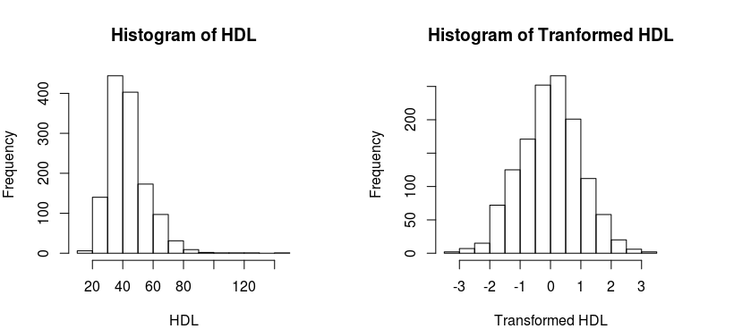

# Genome-wide association analysis
Now that our data is loaded, filtered, and additional SNP genotypes imputed we are ready to perform genome-wide association analysis. This involves regressing each SNP separately on a given trait, adjusted for sample level clinical, environmental, and demographic factors. Due to the large number of SNPs and the generally uncharacterized relationships to the outcome, a simple single additive model will be employed.

The `GWAA` function requires two arguments. The `genodata` argument should specify the entire genotype data object in `SnpMatrix` format. The phenodata argument should be a data frame with a column of sample IDs, corresponding to the row names of genodata, and a columns for the continuous outcome variable. These columns must be named “id” and “phenotype”, respectively. In order to fit the model, genotype data is converted to numeric format using the as function from snpStats. The genotypes of each SNP are then coded as continuous, thereby taking on the value of 0, 1, and 2. For this example, we wish for the value of the genotype to reflect the number of minor alleles. However, following conversion our values will reflect the opposite. To fix this a flip.matrix procedure is included in our `GWAA` function, which can be turned on or off using the `flip` argument.

Due to the large number of models that require fitting, the GWA analysis can be deployed in parallel across multiple processors or machines to reduce the running time. Here we demonstrate two basic methods for performing parallel processing using the doParallel package. This will be carried out differently depending on whether or not the analysis is run on a UNIX based system, though the arguments are the same. The user can specify the number of processes using the `worker` argument (set to 2 by default). Additional arguments include `select.snps` and `nSplits`. The former allows the user to subset the analysis via a vector of SNP IDs. The latter specifies a number of SNP-wise splits that are made to the genotype data. The function runs the GWA analysis on these smaller subsets of the genotype data one at a time. After each subset has finished running the function will print a progress update onto the R console. By default this is set to 10.

## Association analysis of typed SNPs - Step 7
First we create a data frame of phenotype features that is the concatenation of clinical features and the first ten principal components. The HDL feature is normalized using a rank-based inverse normal transform. We then remove variables that we are not including in the analysis, i.e. HDL(non-normalized), LDL, TG, and CAD. Finally, we remove samples with missing normalized HDL data.

```r
## restore the data generated from steps 1-6
load ("Genotype.SNVsfiltered.imputed.target.rultes.Rdata")

## Require GenABEL and GWAA function
library(GenABEL)
source("https://github.com/AAlhendi1707/GWAS/blob/master/R/GWAA.R?raw=true")

# Merge clincal data and principal components to create phenotype table
phenoSub <- merge(clinical,pcs)      # data.frame => [ FamID CAD sex age hdl pc1 pc2 ... pc10 ]

# We will do a rank-based inverse normal transformation of hdl
phenoSub$phenotype <- rntransform(phenoSub$hdl, family="gaussian")

# Show that the assumptions of normality met after transformation
par(mfrow=c(1,2))
hist(phenoSub$hdl, main="Histogram of HDL", xlab="HDL")
hist(phenoSub$phenotype, main="Histogram of Tranformed HDL", xlab="Transformed HDL")
```


```r
# Remove unnecessary columns from table
phenoSub$hdl <- NULL
phenoSub$ldl <- NULL
phenoSub$tg <- NULL
phenoSub$CAD <- NULL

# Rename columns to match names necessary for GWAS() function
colnames(phenoSub)[1]<- "id"

# Include only subjects with hdl data
phenoSub<-phenoSub[!is.na(phenoSub$phenotype),]
# 1309 subjects included with phenotype data

print(head(phenoSub))
```
```
##      id sex age          pc1          pc2          pc3           pc4
## 2 10004   2  50 -0.012045108 -0.007231015 -0.003001290 -0.0107972693
## 3 10005   1  55 -0.016702930 -0.005347697  0.014449836 -0.0006151058
## 4 10007   1  52 -0.009537235  0.004556977  0.002683566  0.0166255657
## 5 10008   1  58 -0.015392106 -0.002446933  0.020508791 -0.0057241772
## 6 10009   1  59 -0.015123858 -0.002353917  0.021360452  0.0069156529
## 7 10010   1  54 -0.012816157  0.005126124  0.014654847 -0.0147082270
##             pc5           pc6           pc7          pc8          pc9
## 2 -0.0077705400 -0.0046457510  0.0018061075 -0.003087891 -0.001833242
## 3  0.0345170160  0.0387085513  0.0205790788 -0.012265508  0.003592690
## 4 -0.0002363142  0.0055146271  0.0159588869  0.027975455  0.029777180
## 5 -0.0039696226  0.0053542437 -0.0007269312  0.027014714  0.010672162
## 6  0.0400677558  0.0232224781  0.0152485234  0.013296852  0.022746352
## 7 -0.0008190769 -0.0003831342 -0.0131606658 -0.013647709 -0.008912913
##           pc10  phenotype
## 2 -0.004538746 -2.2877117
## 3 -0.002287043 -0.4749316
## 4 -0.007461255  0.8855512
## 5 -0.003352997 -0.1644639
## 6  0.013143889  0.3938940
## 7 -0.056187339  1.7109552
```
### Parallel model fitting
Using this phenotype data, we perform model fitting on each of the typed SNPs in the `genotype` object and write the results to a *.txt* file.

```r
# Run GWAS analysis
# Note: This function writes a file, but does not produce an R object
start <- Sys.time()
GWAA(genodata=genotype, phenodata=phenoSub, filename=gwaa.fname)
```
```
## Loading required package: doParallel
## Loading required package: foreach
## Loading required package: iterators
## Loading required package: parallel

## 656890  SNPs included in analysis.
## 1309 samples included in analysis.
## socket cluster with 2 nodes on host 'localhost'
## GWAS SNPs 1-65689 (10% finished)
## GWAS SNPs 65690-131378 (20% finished)
## GWAS SNPs 131379-197067 (30% finished)
## GWAS SNPs 197068-262756 (40% finished)
## GWAS SNPs 262757-328445 (50% finished)
## GWAS SNPs 328446-394134 (60% finished)
## GWAS SNPs 394135-459823 (70% finished)
## GWAS SNPs 459824-525512 (80% finished)
## GWAS SNPs 525513-591201 (90% finished)
## GWAS SNPs 591202-656890 (100% finished)
## [1] "Done."
```
```r
end <- Sys.time()
print(end-start)
GWAA(genodata=genotype, phenodata=phenoSub, filename=gwaa.fname)
```
```
## Time difference of 2.259378 hours
```
```r
# Add phenosub to saved results
save.image("Genotype.SNVsfiltered.imputed.target.rultes.Phenosub.Rdata")
```

## Association analysis of imputed SNPs - Step 8
### Model fitting of non-typed SNPs
We also perform association testing on additional SNPs from genotype imputation. Here we use thesnp.rhs.tests function from `snpStats` to perform the analysis based on the imputation “rules” we calculated previously. We need to specify the variables from the `phenoSub` data frame that we are including in the model with row names corresponding to the sample IDs.

The resulting SNPs are combined with the chromosome position information to create a table of SNPs, location and p-value. Finally, we take *−log10* of the p-value for plotting.

```r
# Carry out association testing for imputed SNPs using snp.rhs.tests()
rownames(phenoSub) <- phenoSub$id

imp <- snp.rhs.tests(phenotype ~ sex + age + pc1 + pc2 + pc3 + pc4 + pc5 + pc6 + pc7 + pc8 + pc9 + pc10,
                     family = "Gaussian", data = phenoSub, snp.data = target, rules = rules)

# Obtain p values for imputed SNPs by calling methods on the returned GlmTests object.
results <- data.frame(SNP = imp@snp.names, p.value = p.value(imp), stringsAsFactors = FALSE)
results <- results[!is.na(results$p.value),]

#Write a file containing the results
write.csv(results, impute.out.fname, row.names=FALSE)

# Merge imputation testing results with support to obtain coordinates
imputeOut<-merge(results, support[, c("SNP", "position")])
imputeOut$chr <- 16

imputeOut$type <- "imputed"

# Find the -log_10 of the p-values
imputeOut$Neg_logP <- -log10(imputeOut$p.value)

# Order by p-value
imputeOut <- arrange(imputeOut, p.value)
print(head(imputeOut))
```
```
##          SNP      p.value position chr    type Neg_logP
## 1  rs1532624 9.805683e-08 57005479  16 imputed 7.008522
## 2  rs7205804 9.805683e-08 57004889  16 imputed 7.008522
## 3 rs12446515 1.430239e-07 56987015  16 imputed 6.844591
## 4 rs17231506 1.430239e-07 56994528  16 imputed 6.844591
## 5   rs173539 1.430239e-07 56988044  16 imputed 6.844591
## 6   rs183130 1.430239e-07 56991363  16 imputed 6.844591
```
### Mapping associated SNPs to genes

Using a separate data file containing the chromosome and coordinate locations of each protein coding gene, we can locate coincident genes and SNPs.
The SNP with the lowest p-value in both the typed and imputed SNP analysis lies within the boundaries of the cholesteryl ester transfer protein gene, CETP. We can call the `map2gene` function for “CETP” to filter the imputed genotypes and extract only those SNPs that are near CETP. This will be used for post-analytic interrogation to follow.

```r
source("https://github.com/AAlhendi1707/GWAS/blob/master/R/map2gene.R?raw=true")
# Read in file containing protein coding genes coords
genes <- read.csv(protein.coding.coords.fname, stringsAsFactors = FALSE)

# Subset for CETP SNPs
impCETP <- map2gene("CETP", coords = genes, SNPs = imputeOut)

# Filter only the imputed CETP SNP genotypes 
impCETPgeno <- imputed[, impCETP$SNP ]
```
save.image("GWAS.steps1-8.Rdata")

