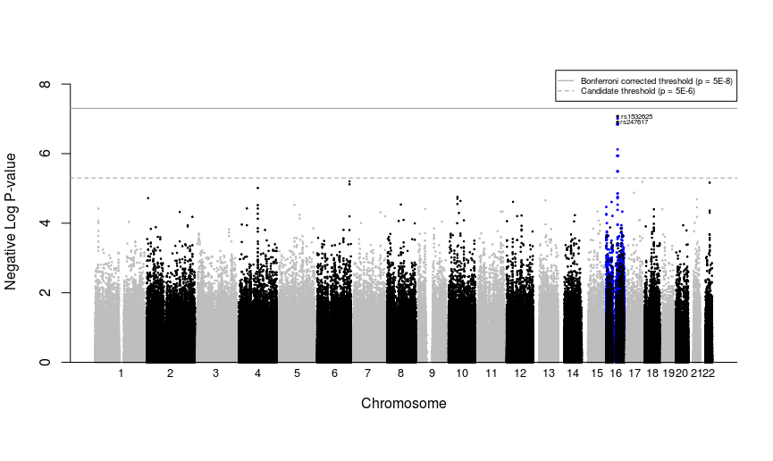
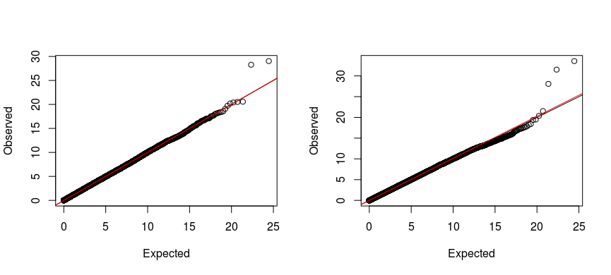
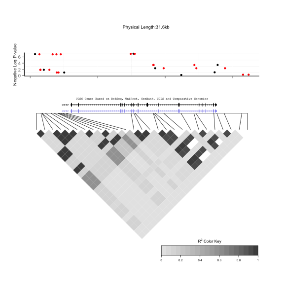
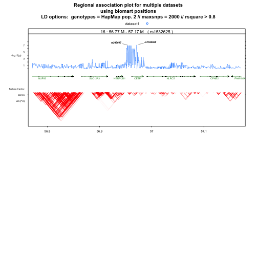

# Post-analytic visualization and genomic interrogation
We now have generated and fit both typed and imputed genotypes. The next step is to combine the results, and isolate just those SNPs in our region of interest. Following similar steps as for imputed SNPs, the typed SNPs are loaded from a file generated by the `GWAA` function. We follow similar steps to attach chromosome and position to each SNP, order by significance, and take *−log10* of the p-value.

## Data Integration
```r
# Read in GWAS output that was produced by GWAA function
GWASout <- read.table(gwaa.fname, header=TRUE, colClasses=c("character", rep("numeric",4)))

# Find the -log_10 of the p-values
GWASout$Neg_logP <- -log10(GWASout$p.value)

# Merge output with genoBim by SNP name to add position and chromosome number
GWASout <- merge(GWASout, genoBim[,c("SNP", "chr", "position")])
rm(genoBim)

# Order SNPs by significance
GWASout <- arrange(GWASout, -Neg_logP)
print(head(GWASout))
```
```
##          SNP   Estimate  Std.Error   t.value      p.value Neg_logP chr
## 1  rs1532625  0.2024060 0.03756207  5.388575 8.452365e-08 7.073022  16
## 2   rs247617  0.2119357 0.03985979  5.317030 1.243480e-07 6.905361  16
## 3 rs10945761  0.1856564 0.04093602  4.535282 6.285358e-06 5.201670   6
## 4  rs3803768 -0.3060086 0.06755628 -4.529685 6.451945e-06 5.190309  17
## 5  rs4821708 -0.1816673 0.04020915 -4.518058 6.825085e-06 5.165892  22
## 6  rs9647610  0.1830434 0.04072772  4.494320 7.607161e-06 5.118777   6
##    position
## 1  57005301
## 2  56990716
## 3 162065367
## 4  80872028
## 5  38164106
## 6 162066421
```
### Combine typed and imputed
Isolate CETP-specific SNPs
The two tables of typed and imputed genotypes are combined into a single table. In addition, we also concatenate just the SNPs near CETP and display them all here.

```r
GWASout$type <- "typed"

GWAScomb<-rbind.fill(GWASout, imputeOut)
head(GWAScomb)
```
```
##          SNP   Estimate  Std.Error   t.value      p.value Neg_logP chr
## 1  rs1532625  0.2024060 0.03756207  5.388575 8.452365e-08 7.073022  16
## 2   rs247617  0.2119357 0.03985979  5.317030 1.243480e-07 6.905361  16
## 3 rs10945761  0.1856564 0.04093602  4.535282 6.285358e-06 5.201670   6
## 4  rs3803768 -0.3060086 0.06755628 -4.529685 6.451945e-06 5.190309  17
## 5  rs4821708 -0.1816673 0.04020915 -4.518058 6.825085e-06 5.165892  22
## 6  rs9647610  0.1830434 0.04072772  4.494320 7.607161e-06 5.118777   6
##    position  type
## 1  57005301 typed
## 2  56990716 typed
## 3 162065367 typed
## 4  80872028 typed
## 5  38164106 typed
## 6 162066421 typed
```
```r
tail(GWAScomb)
```
```
##               SNP Estimate Std.Error t.value   p.value     Neg_logP chr
## 818521 rs62048372       NA        NA      NA 0.9999838 7.048600e-06  16
## 818522  rs8056666       NA        NA      NA 0.9999838 7.048600e-06  16
## 818523  rs8057313       NA        NA      NA 0.9999838 7.048600e-06  16
## 818524  rs8061812       NA        NA      NA 0.9999838 7.048600e-06  16
## 818525  rs9940700       NA        NA      NA 0.9999838 7.048600e-06  16
## 818526 rs13334556       NA        NA      NA 0.9999843 6.825503e-06  16
##        position    type
## 818521 53775940 imputed
## 818522 53794830 imputed
## 818523 53794855 imputed
## 818524 53794856 imputed
## 818525 53795409 imputed
## 818526  5463800 imputed
```
```r
# Subset for CETP SNPs
typCETP <- map2gene("CETP", coords = genes, SNPs = GWASout)

# Combine CETP SNPs from imputed and typed analysis
CETP <- rbind.fill(typCETP, impCETP)[,c("SNP","p.value","Neg_logP","chr","position","type","gene")]
print(CETP)
```
```
##            SNP      p.value   Neg_logP chr position    type gene
## 1    rs1532625 8.452365e-08 7.07302173  16 57005301   typed CETP
## 2     rs289742 3.788738e-04 3.42150548  16 57017762   typed CETP
## 3     rs289715 4.299934e-03 2.36653823  16 57008508   typed CETP
## 4    rs6499863 1.382602e-02 1.85930275  16 56992017   typed CETP
## 5    rs1800777 8.833782e-02 1.05385333  16 57017319   typed CETP
## 6    rs4783962 1.039467e-01 0.98318933  16 56995038   typed CETP
## 7   rs12708980 6.375740e-01 0.19546941  16 57012379   typed CETP
## 8    rs1532624 9.805683e-08 7.00852215  16 57005479 imputed CETP
## 9    rs7205804 9.805683e-08 7.00852215  16 57004889 imputed CETP
## 10  rs17231506 1.430239e-07 6.84459142  16 56994528 imputed CETP
## 11    rs183130 1.430239e-07 6.84459142  16 56991363 imputed CETP
## 12   rs3764261 1.430239e-07 6.84459142  16 56993324 imputed CETP
## 13    rs821840 1.430239e-07 6.84459142  16 56993886 imputed CETP
## 14  rs11508026 1.151771e-06 5.93863373  16 56999328 imputed CETP
## 15  rs12444012 1.151771e-06 5.93863373  16 57001438 imputed CETP
## 16  rs12720926 1.151771e-06 5.93863373  16 56998918 imputed CETP
## 17   rs4784741 1.151771e-06 5.93863373  16 57001216 imputed CETP
## 18  rs34620476 1.155266e-06 5.93731819  16 56996649 imputed CETP
## 19    rs708272 1.155266e-06 5.93731819  16 56996288 imputed CETP
## 20    rs711752 1.155266e-06 5.93731819  16 56996211 imputed CETP
## 21  rs12720922 3.238664e-06 5.48963411  16 57000885 imputed CETP
## 22   rs8045855 3.238664e-06 5.48963411  16 57000696 imputed CETP
## 23  rs12149545 3.245934e-06 5.48866029  16 56993161 imputed CETP
## 24  rs11076175 1.400697e-05 4.85365587  16 57006378 imputed CETP
## 25   rs7499892 1.400697e-05 4.85365587  16 57006590 imputed CETP
## 26   rs1800775 1.747444e-05 4.75759678  16 56995236 imputed CETP
## 27   rs3816117 1.747444e-05 4.75759678  16 56996158 imputed CETP
## 28  rs11076176 1.089765e-04 3.96266723  16 57007446 imputed CETP
## 29    rs289714 1.121002e-04 3.95039374  16 57007451 imputed CETP
## 30    rs158478 2.513994e-04 3.59963575  16 57007734 imputed CETP
## 31   rs9939224 2.868544e-04 3.54233851  16 57002732 imputed CETP
## 32  rs12447620 3.868267e-04 3.41248361  16 57014319 imputed CETP
## 33    rs158480 3.868267e-04 3.41248361  16 57008227 imputed CETP
## 34    rs158617 3.868267e-04 3.41248361  16 57008287 imputed CETP
## 35 rs112039804 4.305196e-03 2.36600705  16 57018856 imputed CETP
## 36  rs12708985 4.305196e-03 2.36600705  16 57014610 imputed CETP
## 37    rs736274 4.305196e-03 2.36600705  16 57009769 imputed CETP
## 38  rs11076174 4.439341e-03 2.35268153  16 57003146 imputed CETP
## 39    rs158479 1.358926e-02 1.86680426  16 57008048 imputed CETP
## 40 rs201825234 1.392675e-02 1.85615030  16 56991948 imputed CETP
## 41   rs2115429 1.392675e-02 1.85615030  16 56992842 imputed CETP
## 42   rs6499861 1.392675e-02 1.85615030  16 56991495 imputed CETP
## 43   rs6499862 1.392675e-02 1.85615030  16 56991524 imputed CETP
## 44    rs289713 1.902194e-02 1.72074521  16 57006829 imputed CETP
## 45  rs12720918 2.238286e-02 1.65008448  16 56994212 imputed CETP
## 46  rs12920974 2.238286e-02 1.65008448  16 56993025 imputed CETP
## 47  rs36229787 3.026885e-02 1.51900413  16 56993897 imputed CETP
## 48    rs820299 4.470355e-02 1.34965802  16 57000284 imputed CETP
## 49    rs289712 4.529779e-02 1.34392301  16 57006305 imputed CETP
## 50  rs34946873 5.624406e-02 1.24992336  16 56991143 imputed CETP
## 51  rs12597002 6.153983e-02 1.21084368  16 57002404 imputed CETP
## 52  rs60545348 6.153983e-02 1.21084368  16 57001985 imputed CETP
## 53    rs708273 6.153983e-02 1.21084368  16 56999949 imputed CETP
## 54   rs4369653 6.333149e-02 1.19838029  16 56997551 imputed CETP
## 55      rs5880 7.129792e-02 1.14692314  16 57015091 imputed CETP
## 56   rs4587963 8.354674e-02 1.07807049  16 56997369 imputed CETP
## 57   rs1800776 9.239564e-02 1.03434852  16 56995234 imputed CETP
## 58    rs289746 9.693910e-02 1.01350102  16 57020205 imputed CETP
## 59  rs12447839 1.042017e-01 0.98212538  16 56993935 imputed CETP
## 60  rs12447924 1.042017e-01 0.98212538  16 56994192 imputed CETP
## 61    rs158477 1.519849e-01 0.81819960  16 57007610 imputed CETP
## 62  rs12720889 2.755963e-01 0.55972661  16 57012563 imputed CETP
## 63  rs12708983 2.772136e-01 0.55718551  16 57014411 imputed CETP
## 64  rs66495554 2.790835e-01 0.55426586  16 57018636 imputed CETP
## 65  rs12934552 3.156022e-01 0.50085994  16 57021433 imputed CETP
## 66  rs12708968 3.597273e-01 0.44402664  16 56994819 imputed CETP
## 67  rs17245715 3.597273e-01 0.44402664  16 56994990 imputed CETP
## 68   rs4783961 4.335221e-01 0.36298880  16 56994894 imputed CETP
## 69  rs12598522 5.138788e-01 0.28913932  16 57022352 imputed CETP
## 70  rs56315364 5.138788e-01 0.28913932  16 57021524 imputed CETP
## 71 rs117427818 5.582634e-01 0.25316088  16 57010486 imputed CETP
## 72  rs36229786 5.721591e-01 0.24248319  16 56993901 imputed CETP
## 73  rs11860407 6.108898e-01 0.21403710  16 57010828 imputed CETP
## 74   rs2033254 6.108898e-01 0.21403710  16 57009985 imputed CETP
## 75   rs1800774 6.293251e-01 0.20112492  16 57015545 imputed CETP
## 76   rs7405284 6.519531e-01 0.18578366  16 57001275 imputed CETP
## 77  rs12708974 9.096021e-01 0.04114853  16 57005550 imputed CETP
```
```
write.csv(CETP, CETP.fname, row.names=FALSE) # save for future use
```

## Visualization and QC - Step 10

Several plots allow us both to visualize the GWA analysis findings while performing quality control checks. Specifically, we are interested in identifying data inconsistencies and potential systemic biases.

### Manhattan plot
Manhattan plots are used to visual GWA significant results by chromosome location. We will call the `GWAS_Manhattan` function to plot *−log10* of the p-value against SNP position across the entire set of typed and imputed SNPs. The plot will show two horizontal lines. The higher of the two is the commonly used “Bonferroni” adjusted significance cut-off of *−log10*(5×10−8), while the lower is less stringent (“Candidate”) cut-off of *−log10*(5×10−6). Typed and imputed SNPs will be represented by black and blue, respectively. We label the typed SNPs with signals that have surpassed the less stringent cutoff.


```r
source("https://github.com/AAlhendi1707/GWAS/blob/master/R/GWAS_ManhattanFunction.R?raw=true")
# Plots Manhattan plot with significant SNPs highlighted.

# Create Manhattan Plot
GWAS_Manhattan(GWAScomb)
```


###  Q–Q plots and the 𝜆-statistic
Q-Q plots are used to visualize the relationship between the expected and observed distributions of SNP level test statistics. Here we compare these statistics for the unadjusted model (left) compared with the model adjusted for confounders by incorporating the first ten principal components along with clinical covariates.

A new set of models is generated with only the phenotype (HDL) and no additional factors. The results are plotted using the GenABEL package's `estlambda` function.

```r
# Rerun the GWAS using unadjusted model
phenoSub2 <- phenoSub[,c("id","phenotype")] # remove all extra factors, leave only phenotype

GWAA(genodata=genotype, phenodata=phenoSub2, filename=gwaa.unadj.fname)
```
```
## 656890  SNPs included in analysis.
## 1309 samples included in analysis.
## socket cluster with 2 nodes on host 'localhost'
## GWAS SNPs 1-65689 (10% finished)
## GWAS SNPs 65690-131378 (20% finished)
## GWAS SNPs 131379-197067 (30% finished)
## GWAS SNPs 197068-262756 (40% finished)
## GWAS SNPs 262757-328445 (50% finished)
## GWAS SNPs 328446-394134 (60% finished)
## GWAS SNPs 394135-459823 (70% finished)
## GWAS SNPs 459824-525512 (80% finished)
## GWAS SNPs 525513-591201 (90% finished)
## GWAS SNPs 591202-656890 (100% finished)
## [1] "Done."
```
```r
GWASoutUnadj <- read.table(gwaa.unadj.fname, header=TRUE, colClasses=c("character", rep("numeric",4)))

# Create QQ plots for adjusted and unadjusted model outputs
par(mfrow=c(1,2))
lambdaAdj <- estlambda(GWASout$t.value^2,plot=TRUE,method="median")
lambdaUnadj <- estlambda(GWASoutUnadj$t.value^2,plot=TRUE,method="median")
```


```r
cat(sprintf("Unadjusted lambda: %s\nAdjusted lambda: %s\n", lambdaUnadj$estimate, lambdaAdj$estimate))
```
```
## Unadjusted lambda: 1.01417377078806
## Adjusted lambda: 1.00214021515846
```
```r
# Calculate standardized lambda
lambdaAdj_1000<-1+(lambdaAdj$estimate-1)/nrow(phenoSub)*1000
lambdaUnadj_1000<-1+(lambdaUnadj$estimate-1)/nrow(phenoSub)*1000
cat(sprintf("Standardized unadjusted lambda: %s\nStandardized adjusted lambda: %s\n", 
lambdaUnadj_1000, lambdaAdj_1000))
```
```
## Standardized unadjusted lambda: 1.0108279379588
## Standardized adjusted lambda: 1.00163500012105
```
We see here that the tail of the distribution is brought closer to the *y=x* line after accounting for confounding by race/ethnicity in the modeling framework. If the data in this figure were shifted up or down from the *y=x* line, then we would want to investigate some form of systemic bias. The degree of deviation from this line is measured formally by the λ-statistic, where a value close to 1 suggests appropriate adjustment for the potential admixture. A slight deviation in the upper right tail from the *y=x* line suggests crudely that some form of association is present in the data. There is only a slight improvement in λ between the unadjusted model and the model with PCs indicating that the population is relatively homogenous.

### Heatmap
Heatmaps are typically used in the context of GWA analysis to visualize the linkage disequilibrium pattern between significant SNPs other SNPs in nearby regions. Here we include our most significant SNP from our analysis and other SNPs near CETP. The darker shading indicates higher LD. The plot also includes *−log10*(p) values to illustrate their connection with physical location and LD.

```r
library(LDheatmap)
library(rtracklayer)

# Add "rs247617" to CETP
CETP <- rbind.fill(GWASout[GWASout$SNP == "rs247617",], CETP)

# Combine genotypes and imputed genotypes for CETP region
subgen <- cbind(genotype[,colnames(genotype) %in% CETP$SNP], impCETPgeno) # CETP subsets from typed and imputed SNPs

# Subset SNPs for only certain genotypes
certain <- apply(as(subgen, 'numeric'), 2, function(x) { all(x %in% c(0,1,2,NA)) })
subgen <- subgen[,certain]

# Subset and order CETP SNPs by position
CETP <- CETP[CETP$SNP %in% colnames(subgen),]
CETP <- arrange(CETP, position)
subgen <- subgen[, order(match(colnames(subgen),CETP$SNP)) ]

# Create LDheatmap
ld <- ld(subgen, subgen, stats="R.squared") # Find LD map of CETP SNPs

ll <- LDheatmap(ld, CETP$position, flip=TRUE, name="myLDgrob", title=NULL)

# Add genes, recombination
llplusgenes <- LDheatmap.addGenes(ll, chr = "chr16", genome = "hg19", genesLocation = 0.01)

# Add plot of -log(p)
library(ggplot2)

plot.new()
llQplot2<-LDheatmap.addGrob(llplusgenes, rectGrob(gp = gpar(col = "white")),height = .34)
pushViewport(viewport(x = 0.483, y= 0.76, width = .91 ,height = .4))

grid.draw(ggplotGrob({
  qplot(position, Neg_logP, data = CETP, xlab="", ylab = "Negative Log P-value", xlim = range(CETP$position),
        asp = 1/10, color = factor(type), colour=c("#000000", "#D55E00")) + 
    theme(axis.text.x = element_blank(),
          axis.title.y = element_text(size = rel(0.75)), legend.position = "none", 
          panel.background = element_blank(), 
          axis.line = element_line(colour = "black")) +
    scale_color_manual(values = c("red", "black"))
}))
```


### Regional Association
Similar to the LD heatmap above, a regional association plot allows for visualization of SNP-wise signal accross a segment of a particular chromsome with the pairwise correlation between SNPs. However regional assoication plots typically show a larger window of the genome. Therefore, for plot legibility, LD calculations to be displayed can be selected based on pairwise SNP proximity and minimum LD. In this example we demonstrate a regional plot create by the `regionplot` function from postgwas. This function can use HapMap data downloaded from [Ensembl](http://www.ensembl.org/index.html), for LD calculations. By default it will use the most recent [Genome Reference Consortium](http://www.ncbi.nlm.nih.gov/projects/genome/assembly/grc/) human genome build. Therefore, if we wish to use build GRCh37 (hg19) we will have to create a custom `biomartConfigs` object to retrieve the appropriate data.

```r
# Create regional association plot
# Create data.frame of most significant SNP only
library(postgwas)

snps<-data.frame(SNP=c("rs1532625"))

# Change column names necessary to run regionalplot function
GWAScomb <- rename(GWAScomb, c(p.value="P", chr="CHR", position="BP"))


# Edit biomartConfigs so regionalplot function
# pulls from human genome build 37/hg19

myconfig <- biomartConfigs$hsapiens
myconfig$hsapiens$gene$host <- "grch37.ensembl.org"
myconfig$hsapiens$gene$mart <- "ENSEMBL_MART_ENSEMBL"
myconfig$hsapiens$snp$host <- "grch37.ensembl.org"
myconfig$hsapiens$snp$mart <- "ENSEMBL_MART_SNP"


# Run regionalplot using HAPMAP data (pop = CEU)
regionalplot(snps, GWAScomb, biomart.config = myconfig, window.size = 400000, draw.snpname = data.frame(
  snps = c("rs1532625", "rs247617"), 
  text = c("rs1532625", "rs247617"),
  angle = c(20, 160),
  length = c(1, 1), 
  cex = c(0.8)
),
ld.options = list(
  gts.source = 2, 
  max.snps.per.window = 2000, 
  rsquare.min = 0.8, 
  show.rsquare.text = FALSE
),
out.format = list(file = NULL, panels.per.page = 2))
```


